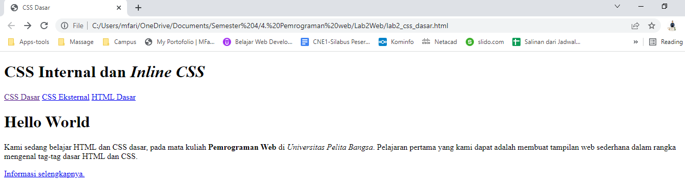
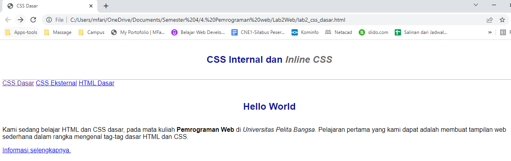
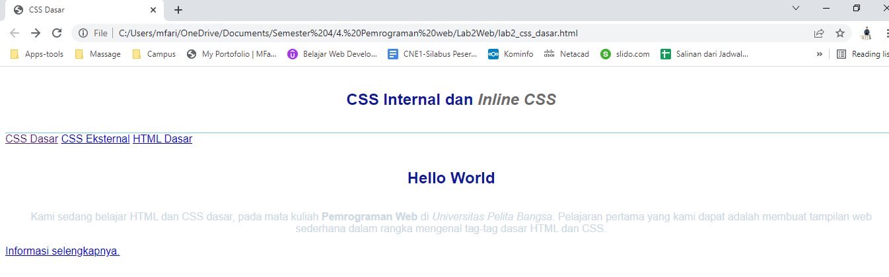
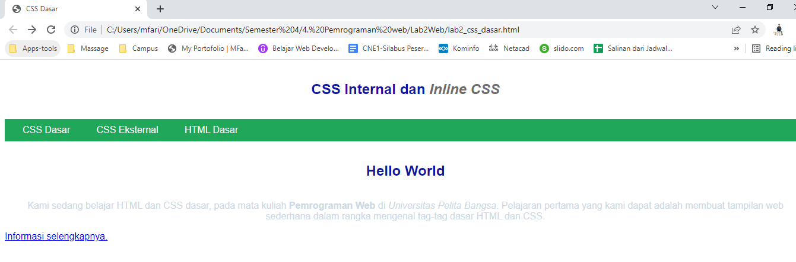

# Lab2Web

Repository ini dibuat untuk memenuhi tugas pemrograman web pertemuan 3

**Nama  : Mohamad Farizal Arifin**

**Nim   : 312010231**

**Kelas : TI.20.B.1**

1. Langkah pertama pada petunjuk module praktikum lab 2 web ini adalah dengan membuat dokumen html sebagai berikut

```
<!DOCTYPE html>
<html lang="en">
<head>
    <meta charset="UTF-8">
    <meta name="viewport" content="width=device-width, initial-scale=1.0">
    <title>CSS Dasar</title>
</head>

<body>
    <header>
        <h1>CSS Internal dan <i>Inline CSS</i></h1>
    </header>
    <nav>
        <a href="lab2_css_dasar.html">CSS Dasar</a>
        <a href="lab2_css_eksternal.html">CSS Eksternal</a>
        <a href="lab1_tag_dasar.html">HTML Dasar</a>
    </nav>
<!-- CSS ID Selector -->
    <div id="intro">
        <h1>Hello World</h1>
        <p>Kami sedang belajar HTML dan CSS dasar, pada mata kuliah <b>Pemrograman
        Web</b> di <i>Universitas Pelita Bangsa</i>. Pelajaran pertama yang kami dapat
        adalah membuat tampilan web sederhana dalam rangka mengenal tag-tag dasar HTML
        dan CSS.</p>
<!-- CSS Class Selector -->
        <a class="button btn-primary" href="#intro">Informasi selengkapnya.</a>
    </div>
</body>
</html>
```
<br>

Jika source code dijalankan maka akan tampil seperti gambar berikut : <br><br>
 <br>
<br>

2. Mendeklarasikan CSS internal<br>
Selanjutnya menambahkan deklarasi CSS internal seperti berikut pada bagian head dokumen

```
<!DOCTYPE html>
<html lang="en">
<head>
    <title>CSS Dasar</title>
    <style>
        body {
            font-family:'Open Sans', sans-serif;
        }
        header {
            min-height: 80px;
            border-bottom:1px solid #77CCEF;
        }
        h1 {
            font-size: 24px;
            color: #0F189F;
            text-align: center;
            padding: 20px 10px;
        }
        h1 i {
            color:#6d6a6b;
        }
    </style>
</head>

<body>
    <header>
        <h1>CSS Internal dan <i>Inline CSS</i></h1>
    </header>
    <nav>
        <a href="lab2_css_dasar.html">CSS Dasar</a>
        <a href="lab2_css_eksternal.html">CSS Eksternal</a>
        <a href="lab1_tag_dasar.html">HTML Dasar</a>
    </nav>
<!-- CSS ID Selector -->
    <div id="intro">
        <h1>Hello World</h1>
        <p>Kami sedang belajar HTML dan CSS dasar, pada mata kuliah <b>Pemrograman
        Web</b> di <i>Universitas Pelita Bangsa</i>. Pelajaran pertama yang kami dapat
        adalah membuat tampilan web sederhana dalam rangka mengenal tag-tag dasar HTML
        dan CSS.</p>
<!-- CSS Class Selector -->
        <a class="button btn-primary" href="#intro">Informasi selengkapnya.</a>
    </div>
</body>
</html>
```
<br>

Save perubahan tersebut dan lakukan refresh pada web browser untuk melihat hasilnya<br>
<br>

 <br>
<br>

3. Menambahkan inline CSS<br>
Langkah yg ketiga menambahkan deklarasi inline CSS pada tag \<p>
```
<h1>Hello World</h1>
        <p style="text-align: center; color: #ccd8e4;">Kami sedang belajar HTML dan CSS dasar, pada mata kuliah <b>Pemrograman
        Web</b> di <i>Universitas Pelita Bangsa</i>. Pelajaran pertama yang kami dapat
        adalah membuat tampilan web sederhana dalam rangka mengenal tag-tag dasar HTML
        dan CSS.</p>
```
<br>

Simpan dan refresh kembali browser untuk melihat perubahannya<br>
<br>

 <br>
<br>

4. Membuat CSS eksternal<br>
Buatlah file baru dengan nama *style_eksternal.css* kemuadian buatlah deklarasi CSS sebagai berikut<br>
```
nav {
    background: #20A759;
    color:#fff;
    padding: 10px;
}
nav a {
    color: #fff;
    text-decoration: none;
    padding:10px 20px;
}
nav .active,
nav a:hover {
    background: #0B6B3A;
}
```
<br>

Selanjutnya tambahkan tag \<link> untuk merujuk file css yang sudah dibuat pada bagian \<head>
<br>

```
<head>
        <h1>CSS Internal dan <i>Inline CSS</i></h1>
    </head>
    <nav>
        <a href="lab2_css_dasar.html">CSS Dasar</a>
        <a href="lab2_css_eksternal.html">CSS Eksternal</a>
        <a href="lab1_tag_dasar.html">HTML Dasar</a>
        <link rel="stylesheet" href="style_eksternal.css" type="text/css">
    </nav>
```
<br>

Simpan dan refresh kembali browser untuk melihat perubahannya<br>
<br>

 <br>